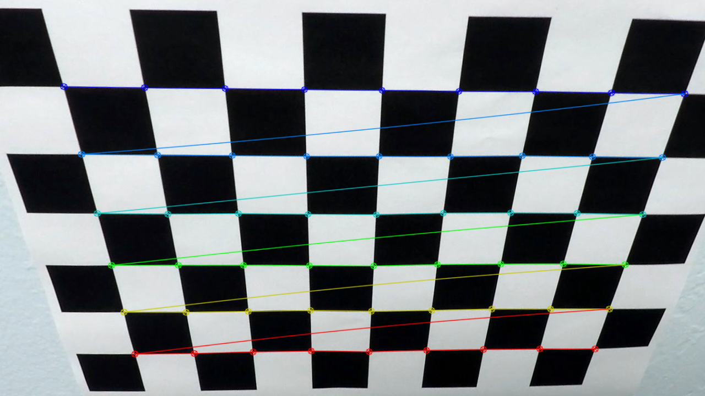
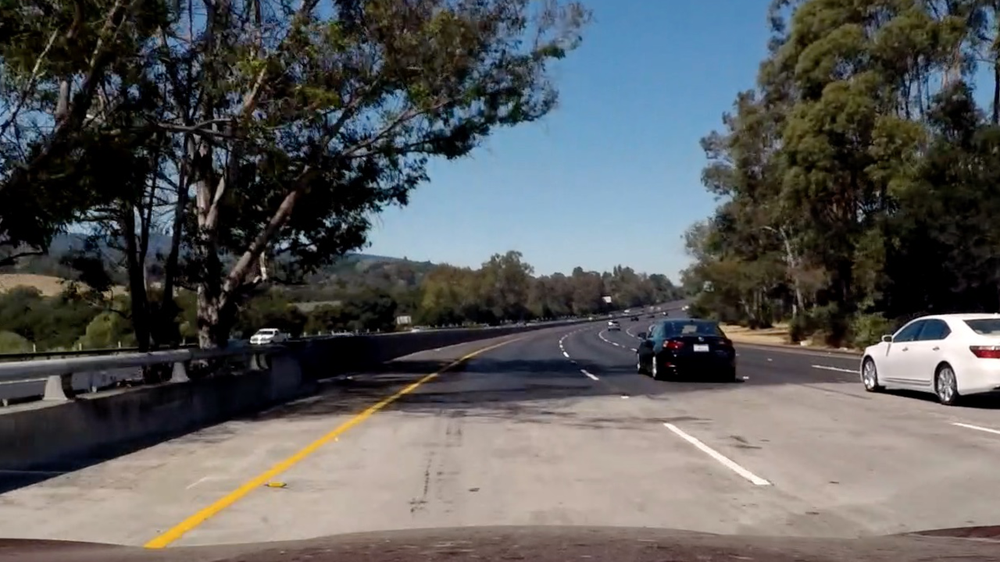

# **Advanced Finding Lane Lines on the Road**
---

**Advanced Finding Lane Lines on the Road**

The goals / steps of this project are the following:

* Compute the camera calibration matrix and distortion coefficients given a set of chessboard images.
* Apply a distortion correction to raw images.
* Use color transforms, gradients, etc., to create a thresholded binary image.
* Apply a perspective transform to rectify binary image ("birds-eye view").
* Detect lane pixels and fit to find the lane boundary.
* Determine the curvature of the lane and vehicle position with respect to center.
* Warp the detected lane boundaries back onto the original image.
* Output visual display of the lane boundaries and numerical estimation of lane curvature and vehicle position.


[//]: # (Image References)

[image1]: ./test_images/test5.jpg "image"
[image2]: ./output_images/test5_undistorted.jpg "undist"
[image3]: ./output_images/test5_binary.jpg "binary"
[image4]: ./output_images/test5_perspective_transform.jpg "warp"
[image5]: ./output_images/test5_fitted_lines.jpg "fitted"
[image6]: ./output_images/test_images/test5.jpg "result"

[image7]: ./camera_cal/calibration2.jpg "cali"
[image8]: ./output_images/calibration2_undistorted.jpg "cali-undist"


---

## Reflection

### Pipeline Description

My pipeline consisted of the following steps:

* Correct for image distortion
* Apply Gaussian smoothing
* Create a thresholded binary image
* Apply a region mask to the image
* Perspective transform the image
* Identify lane line pixels and calculate the lane's curvature
* Visualize lane and warp the rendering onto the original image
* Output curvature and distance from center onto the image

Before passing images through the pipeline, there is some pre-processing to do. To accomplish this, I used a series of 20 images of a chessboard taken at various angles. Using openCV's findChessboardCorners, I can easily find the corners and add the returned items to an objectpoints and imagepoints array to store the 3d points in real world space and the 2d points in the image plane respectively. The image on the left shows the raw image while the image on the right has been undistorted.
<p align="center">
  
   
</p>


Now the objectpoints and imagepoints can be applied to the original road image on the left to create the undistorted image on the right.
<p align="center">
  
   
</p>


Next I apply Gaussian smoothing to help with the thresholding in the next step. This ensures that the gradients are smoothed out and makes it easier to distinguish lines.

Creating the Binary threshold requires color transforms and gradients. For color transforms I used RGB, HLS, HSV, and LAB color spaces. After trying several low/high thresholds for each channel in the four color spaces, I ended up using the B, S, V, and L channels from each color space. For each of these channels I calculated the Sobel and the X-gradient to detect edges and emphasize the near vertical edges.
```Python
def sobelThresh(img_channel, s_thresh, sx_thresh):
	
    #Apply x gradient to emphasize verticle lines
    sobelx = np.absolute(cv2.Sobel(img_channel, cv2.CV_64F, 1, 0))
    #Resize to an 8-bit integer
    scaled_sobel = np.uint8(255*sobelx/np.max(sobelx))

    #Create binary image based on X-Gradient
    sobel = np.zeros_like(scaled_sobel)
    sobel[(scaled_sobel >= sx_thresh[0]) & (scaled_sobel <= sx_thresh[1])] = 1

    #Create binary image based on Sobel only
    chanThresh = np.zeros_like(img_channel)
    chanThresh[(img_channel >= s_thresh[0]) & (img_channel <= s_thresh[1])] = 1

    #Combine x-gradient and sobel binary image
    combined = np.zeros_like(chanThresh)
    combined[(chanThresh == 1) | (sobel == 1)] = 1
```
```Python
def threshold(img, s_thresh=(170,255), sx_thresh=(20,100)):

    #RGB color space
    B_channel = img[:,:,2] #Clear lines on some images, low-moderate noise
    B_channel = sobelThresh(B_channel, (220,255), (20,100))

    #HLS color space
    hls = cv2.cvtColor(img, cv2.COLOR_BGR2HLS)
    S_channel = hls[:,:,2] #Clear lines on all images, low noise
    S_channel = sobelThresh(S_channel, s_thresh, sx_thresh)

    #HSV color space
    hsv = cv2.cvtColor(img, cv2.COLOR_BGR2HSV)
    v_channel = hsv[:,:,2] #Clear lines on most images, low-moderate noise
    v_channel = sobelThresh(v_channel, (220,255), (20,100))

    #LAB color space
    lab = cv2.cvtColor(img, cv2.COLOR_BGR2LAB)
    l_channel = lab[:,:,0] #Clear lines on most images, low-moderate noise
    l_channel = sobelThresh(l_channel, (210,255), (20,100))

    #Combine the best channels from each color space
    thresh = np.zeros_like(S_channel)
    thresh[(S_channel == 1) | (B_channel == 1) | (v_channel == 1) | (l_channel == 1)] = 1
```

When the Sobel and X-gradient are applied to the B, S, V, and L channels the resulting binary threshold is shown in the image below.
![alt text][image3]


After the binary image is achieved, I apply a region mask to isolate the lane lines. This reduces the noise from around and above the lines to help improve the performance of the line detection later on.

Next is the perspective transform. This involves setting four points on the image roughly outlining the lane and transforming them into parallel lines that represent a bird's eye view of the lane. openCV's getPerspectiveTransform takes the source and destination points and returns the transform matrix that is needed to created the warped lane.
```Python
def perspectiveTransform(img):
	...
	
    #Create source image points
    src = np.float32([[max_x*0.465, max_y*0.625], #top left
                     [max_x*0.156, max_y],      #bottom left
                     [max_x*0.879, max_y],     #bottom right
                     [max_x*0.539, max_y*0.625]]) #top right

    #Create destination image points
    dst = np.float32([[max_x*0.234,0],
                     [max_x*0.234, max_y],
                     [max_x*0.742, max_y],
                     [max_x*0.742, 0]])

    #Get matrix to show how to transform image from source to destination points
    M = cv2.getPerspectiveTransform(src, dst)
    Minv = cv2.getPerspectiveTransform(dst, src)

    #Warp the image
    warped = cv2.warpPerspective(img, M, img_size)
```
The following image is an example of a warped lane.
![alt text][image4]


At last we are able to fit lines to the image. The code below is for a image with no prior line data, but this project is equipped to compute a weighted average on prior line data. The lines are detected using a histogram to find the highest pixel values in the image. Then that x-position is used as a sliding window to find other high pixel areas within a margin of the previously detected lane. Numpy's polyfit function is used to fit polynomials with the selected x-values.
```Python
def find_lane_pixels(binary_warped, Lline, Rline):

    # Take a histogram of the bottom half of the image
    histogram = np.sum(binary_warped[binary_warped.shape[0]//2:,:], axis=0)
    
    # Find the peak of the left and right halves of the histogram
    # These will be the starting point for the left and right lines
    midpoint = np.int(histogram.shape[0]//2)
    leftx_base = np.argmax(histogram[:midpoint])
    rightx_base = np.argmax(histogram[midpoint:]) + midpoint

    # Choose the number of sliding windows
    nwindows = 20
    # Set the width of the windows +/- margin
    margin = 50
    # Set minimum number of pixels found to recenter window
    minpix = 75

    ...

    # Step through the windows one by one
    for window in range(nwindows):
		 ...
        #Find the four below boundaries of the window
        win_xleft_low = leftx_current - margin
        win_xleft_high = leftx_current + margin
        win_xright_low = rightx_current - margin
        win_xright_high = rightx_current + margin

        ...

        #Identify the nonzero pixels in x and y within the window
        good_left_inds = ((nonzeroy >= win_y_low) & (nonzeroy < win_y_high) & (nonzerox >= win_xleft_low) & (nonzerox < win_xleft_high)).nonzero()[0]
        good_right_inds = ((nonzeroy >= win_y_low) & (nonzeroy < win_y_high) & (nonzerox >= win_xright_low) & (nonzerox < win_xright_high)).nonzero()[0]

        ...

        # If you found > minpix pixels, recenter next window
        if len(good_left_inds) > minpix:
            leftx_current = np.int(np.mean(nonzerox[good_left_inds]))
        if len(good_right_inds) > minpix:
            rightx_current = np.int(np.mean(nonzerox[good_right_inds]))

	...

    # Extract left and right line pixel positions
    leftx = nonzerox[left_lane_inds]
    lefty = nonzeroy[left_lane_inds]
    rightx = nonzerox[right_lane_inds]
    righty = nonzeroy[right_lane_inds]

    #Create fitted lines
    Lfit = np.polyfit(lefty, leftx, 2)
    Rfit = np.polyfit(righty, rightx, 2)
```
After the lines have been detected, they are drawn on the warped image as shown below.
![alt text][image5]

The next step is to calculate the curvature of the lane as well as the distance of the vehicle from center. To calculate the lane curvature, I used the following equation. 

<a href="https://www.codecogs.com/eqnedit.php?latex=R_{Curve}&space;=&space;\frac{(1&space;&plus;&space;(2Ay&space;&plus;&space;B)^{2})^{\frac{3}{2}}}{\left&space;|&space;2A\right&space;|}" target="_blank"></a>

To calculate the distance from center I simply subtracted the center of the lane from the center of the image (which represented the middle of the car) and converted from pixels to meters. Below are the calculations in Python

```Python

#Calculate curve values for each line
left_curve =  ((1 + (2*left_fit_cr[0]*y_eval*ym_per_pix + left_fit_cr[1])**2)**1.5) / np.absolute(2*left_fit_cr[0])
right_curve =  ((1 + (2*right_fit_cr[0]*y_eval*ym_per_pix + right_fit_cr[1])**2)**1.5) / np.absolute(2*right_fit_cr[0])
#Round curve value to the nearest integer
left_curve = int(round(left_curve))
right_curve = int(round(right_curve))

#if both lines fitted, calculate distance from lane center
if left_fitx is not None and right_fitx is not None:
    #True center of image - represents where the car is
    img_center = img_shape[0] * xm_per_pix
    #Real world integer value of the lines location
    Lfit_int = left_fit_cr[0]*y_eval**2 + left_fit_cr[1]*y_eval + left_fit_cr[2]
    Rfit_int = right_fit_cr[0]*y_eval**2 + right_fit_cr[1]*y_eval + right_fit_cr[2]
    #Shows where the line center is in the image
    car_position = (Rfit_int + Lfit_int) / 2
    #Determine distance from the center of the frame to the center of the lane
    center_dist = (img_center - car_position)
    #Round answer to two decimal places
    center_dist = round(center_dist, 2)
```


Finally, after all the steps are put together the result is shown in the image below.
![alt text][image6]


### Shortcomings of the Pipeline

The biggest shortcoming of the pipeline come from steep curves, extraneous lines on the pavement, and direct sunlight. This pipeline can't detect lanes with steep lines or in direct sunlight. Extraneous lines, like the construction in challenge_video.mp4, can be avoided for the most part. I made countless versions of the pipeline; some performed better with extra lines, other with direct sunlight. In the end I went with the one that covered all cases evenly because a specialized lane finding algorithm won't be of much use in the real world.


### Improvements to the Pipeline

To detect steep curves, I would need to implement another solution besides this sliding window approach. This is because in steep curves one lane can move into the detection area of the other lane, causing the algorithm to believe it is actually a semi-straight lane. One potential solution could be applying a vertical sliding window in addition to the horizontal window.

The direct sunlight problem is more difficult. Since the bright light washes out the colors, no amount of thresholding can retrieve data from all-white pixels. Instead, the solution for this could be to create a line planning algorithm that will predict where the line will go next. This would be difficult to get accurate enough to work in the steep curves of the harder_challenge_video.mp4, but I believe it would be a better and more robust solution that relying entirely on getting clear data from the on-board cameras.
